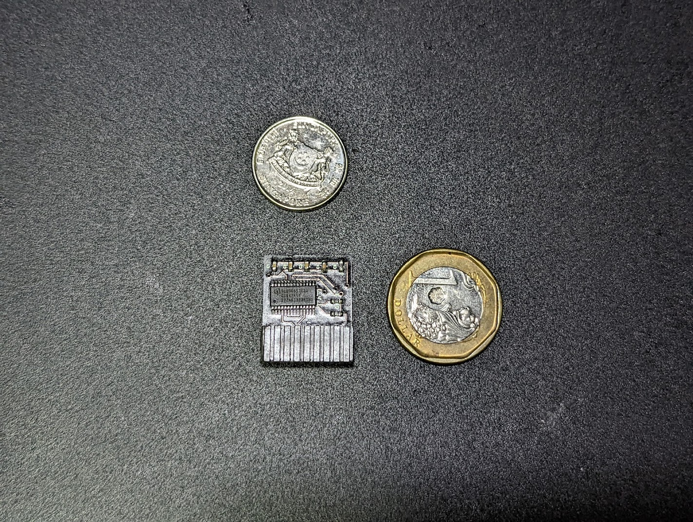
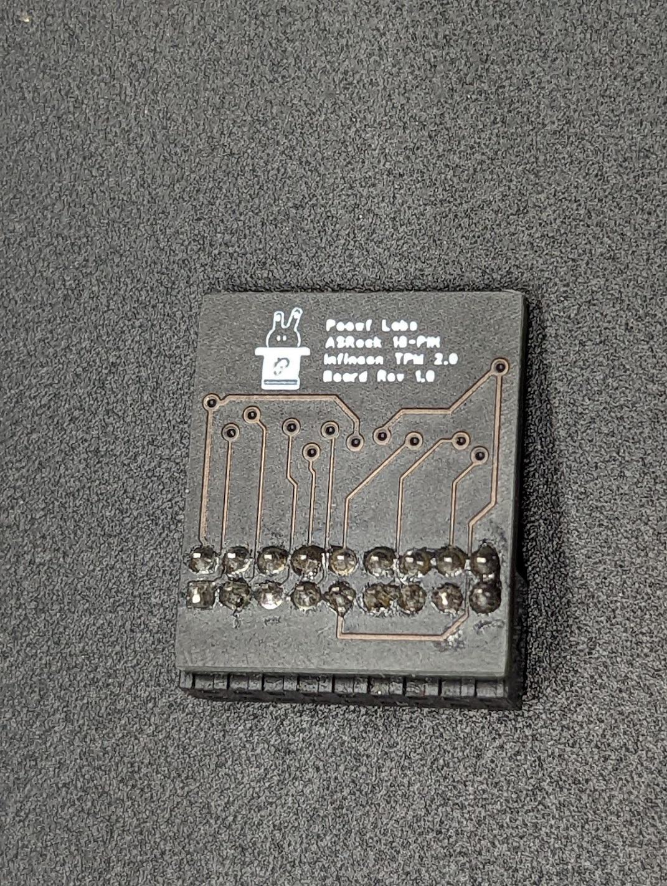
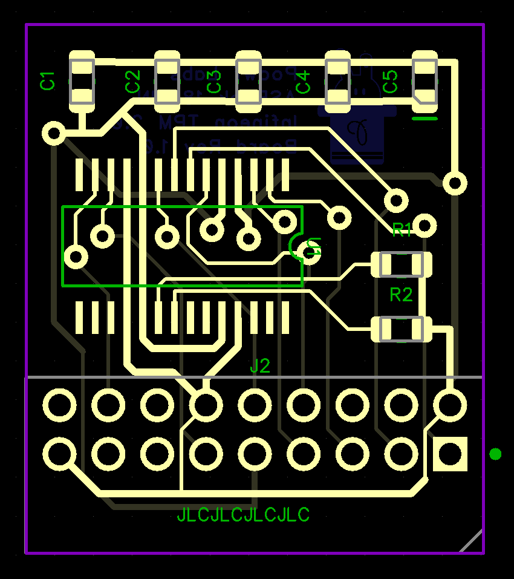
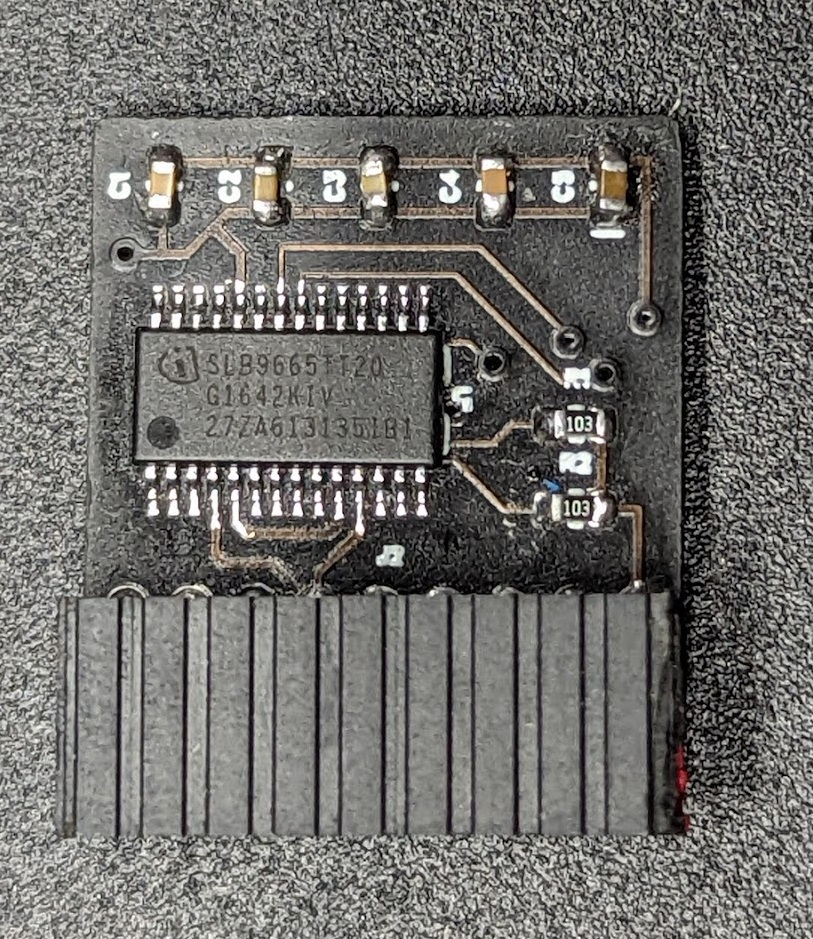
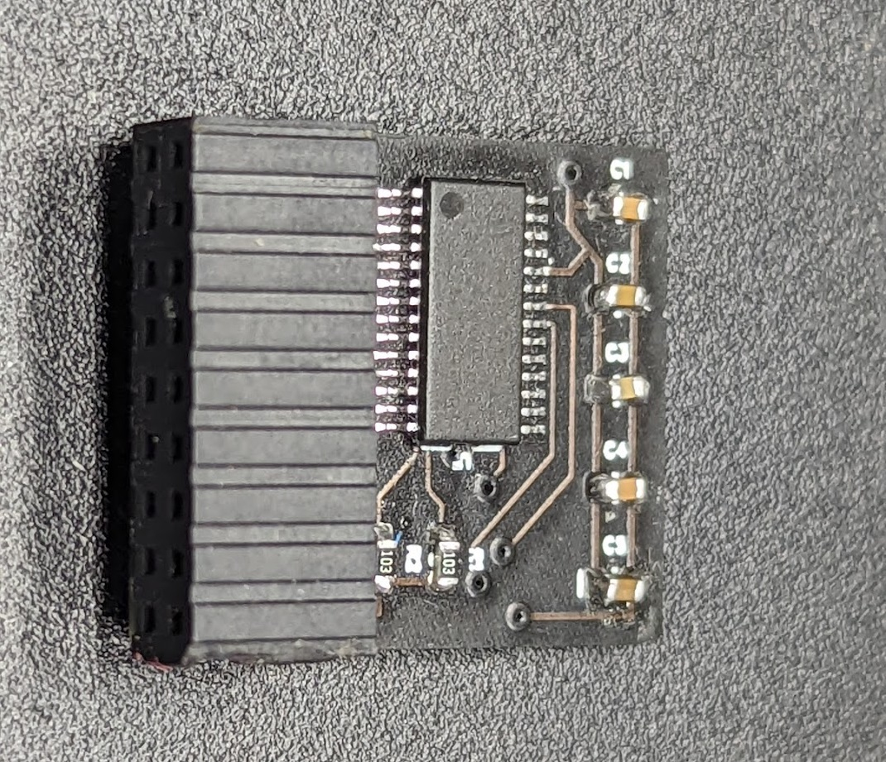
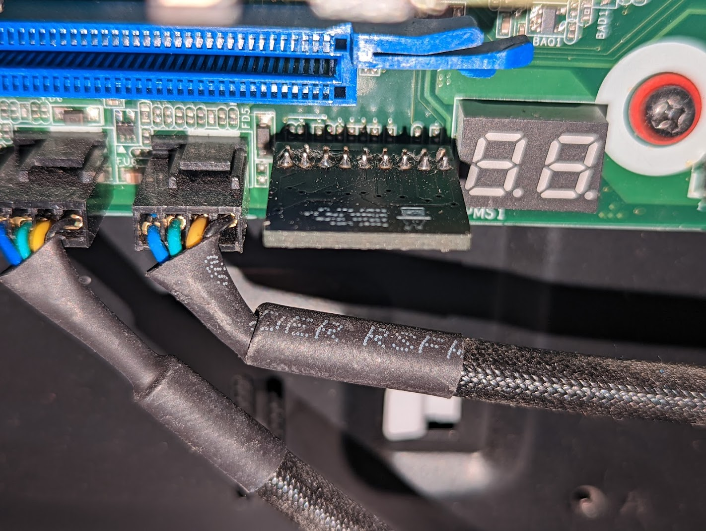
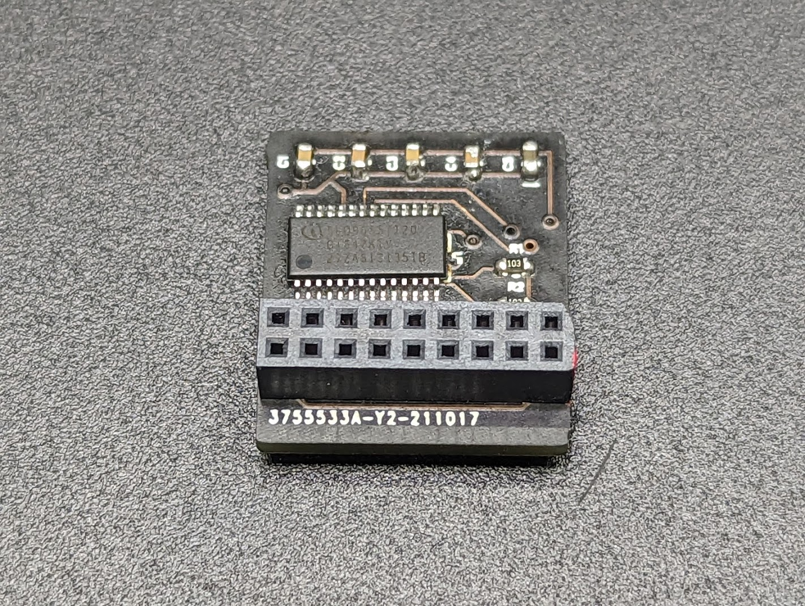
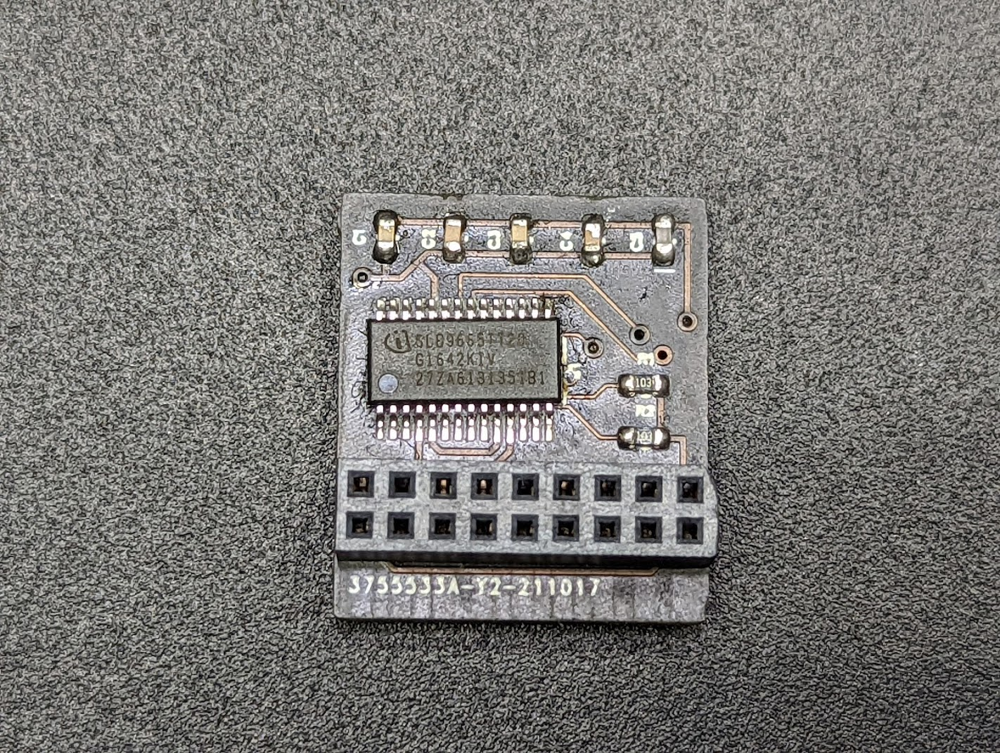
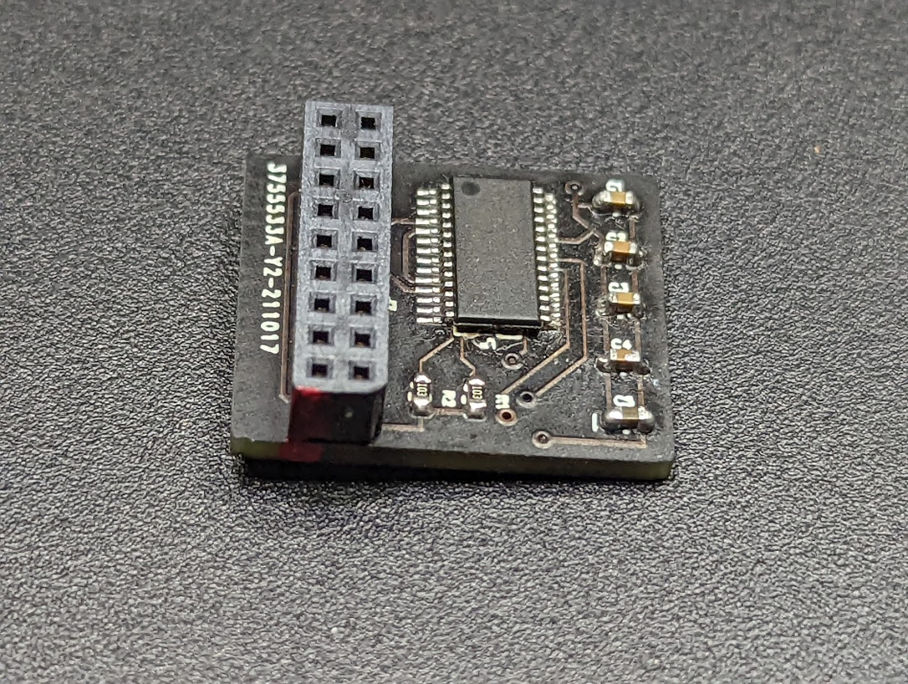
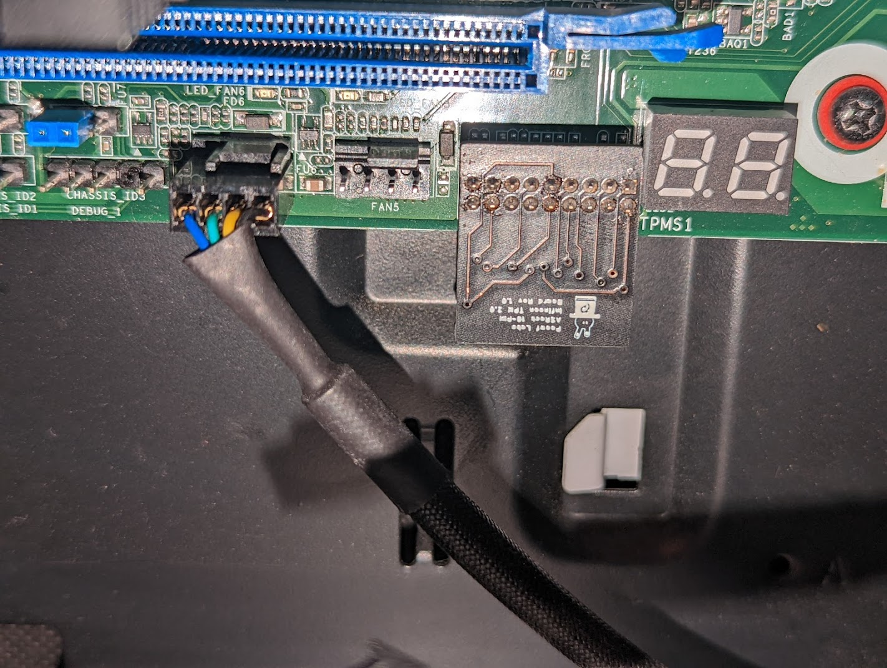

# ASRock 18-Pin TPM

The 18-Pin is the equivalent of the official TPM2-S/INFINEON.

There are 2 variants for this TPM.

The Main Variant mounts with the Components facing towards the PCIe Slots.

The Reverse Variant mounts with Components facing away from the PCIe Slots.

## Fabricated

## Normal

## Reverse

### Reverse Orientation

### Right Angled (Reverse)

