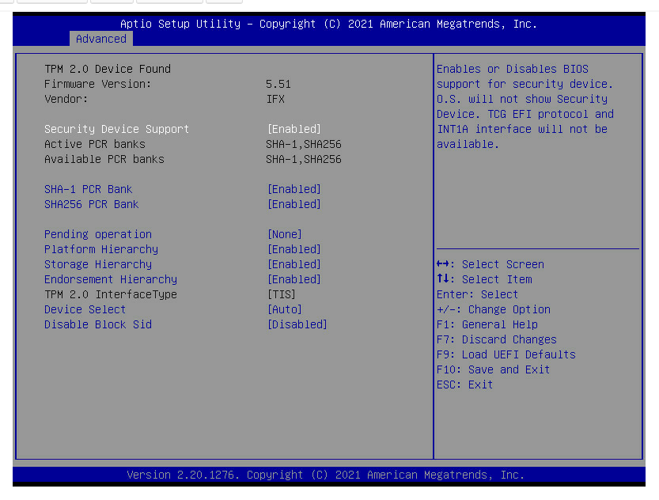
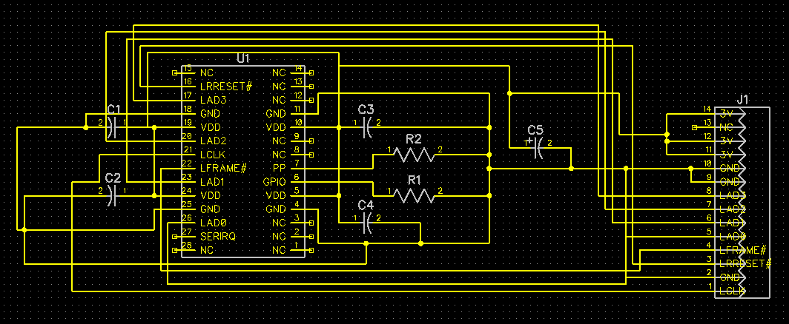
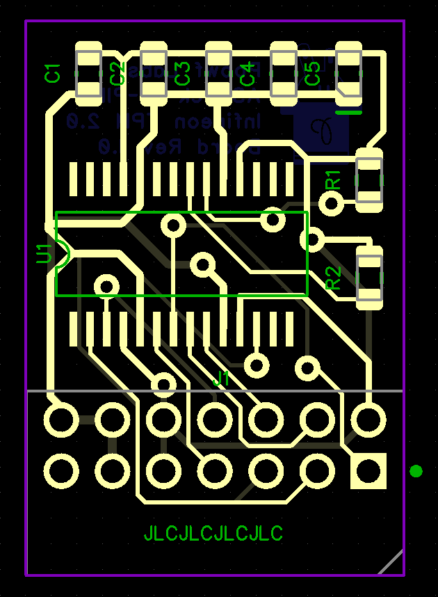
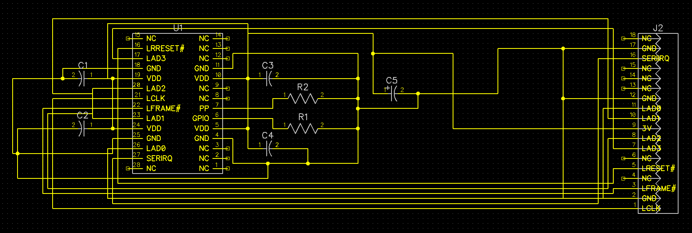
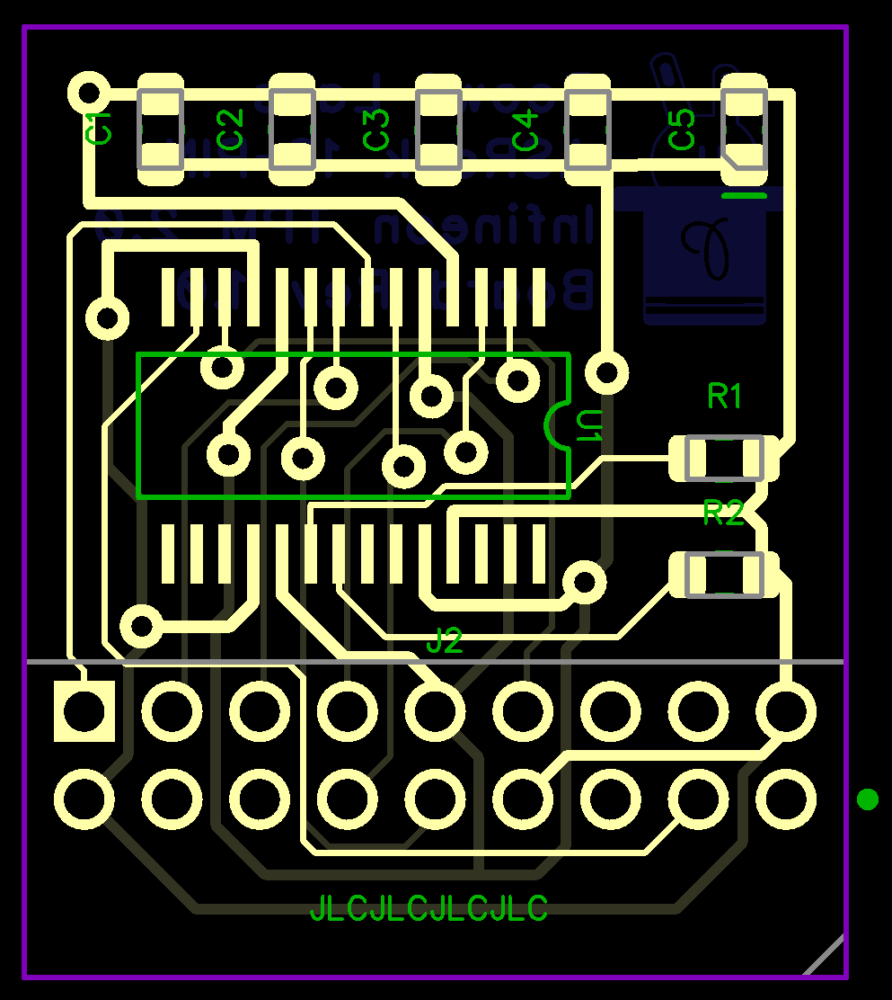

# ASRock TPM 14 & 18-Pin

These TPMs use the Infineon SLB9665 chip

## ASRock 14-Pin TPM

The 14-Pin is the equivalent of the official ASRock TPM2-SLI.

## ASRock 18-Pin TPM

The 18-Pin is the equivalent of the official TPM2-S/INFINEON.

There are 2 variants for this TPM.

The Main Variant mounts with the Components facing towards the PCIe Slots.

The Reverse Variant mounts with Components facing away from the PCIe Slots.

